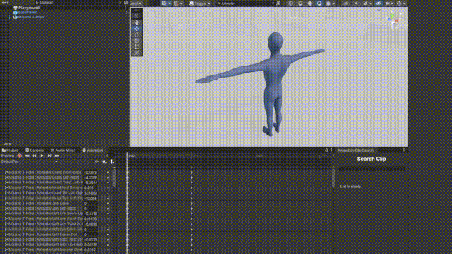

# Animation Clip Search



## Overview
The Animation Clip Search addresses a common limitation in Unity's default Animation window: the lack of a search bar for finding specific animation clips. This custom Unity Editor window tool simplifies the management and search of animation clips within your Unity project, providing a streamlined interface that enhances productivity and efficiency.

## Features
- **Searchable Interface:** Quickly find animation clips with an integrated search bar.
- **Dynamic List:** Automatically updates based on your current selection.
- **Real-Time Results:** Instantly reflects changes as you adjust selections in the editor.
- **Custom Styling:** Clean, consistent UI for a better user experience.

## Installation
1. **Clone or Download:** Clone the repository or download the ZIP file from GitHub.

    ```bash
    git clone https://github.com/RoxDevvv/UnityAnimationWindowSearch.git
    ```

2. **Import into Unity:** Drag the `Editor` folder from the repository into your Unity project's Assets folder.

## Usage
1. **Open the Tool:** In Unity, navigate to `Tools/Animation Clip Search` to launch the custom editor window.

2. **Search and View Animation Clips:** Use the intuitive UI to search for and view animation clips. The tool updates dynamically based on the currently selected GameObject, providing a more efficient way to find specific clips.

3. **Interact with Clips:** Click on the buttons in the ListView to interact with each animation clip

## Customization
To customize the tool:
- **Modify UXML and USS:**
  - `AnimationClipSearchWindow.uxml`: Adjust the layout of the editor window UI.
  - `AnimationClipSearchWindow.uss`: Customize the styling and appearance of UI elements.
- **Adjust Script Logic:**
  - `AnimationClipSearchWindow.cs`: Update the logic for populating the list of animation clips and handling interactions.

## Development
Suggestions and contributions are always welcome! Feel free to open an issue or submit a pull request.
 
## Future Plans
I am considering adding the ability to search and select specific properties within the Animation window, but this feature may be implemented in a future update.

## License
This project is licensed under the MIT License. See the [LICENSE](LICENSE) file for details.

## Contact
For questions or support, please contact:

- **Author:** Ahmed Amine Laaraf
- **Email:** aminelaaraf@gmail.com
- **GitHub:** [My GitHub Profile](https://github.com/RoxDevvv)
